# DoubleDice platform contract

The DoubleDice (DD) platform allows users to commit an amount of money (ERC-20 tokens) to a prediction that specific future event resolves to a specific outcome from a predefined list of 2 or more mutually-exclusive possible outcomes. E.g. the specific event could be “FIFA World Cup 2022 final qualifiers winner” and 16 outcomes would represent the 16 participating football teams.

The DD platform enables a group of users to *virtually* gather on a *floor* and announce their commitments to different outcomes: “Put me 10$ on a Brazil win”, “Put me 100$ on an Argentina win”. In keeping with this imagery, the entire set of data pertaining to an event and its associated commitments are termed a *virtual-floor* (VF).

The DD platform is distinguished by the following two features:

1. When a VF is resolved to one of the outcomes, the total funds committed to all non-winning outcomes are distributed between the commitments to the winning outcome, proportionally to the amount committed to that winning-outcome, but also weighted with a special *beta* factor such that commitments that were made earlier are rewarded higher.
1. Funds committed to an outcome at a specific timepoint are issued with “commitment receipts” (ERC-1155 token balances) that can then be traded freely between users. Once a VF has been resolved to the winning outcome, the Contract allows users holding commitment balances on the winning outcome to claim their winnings.

## Contract architecture

The DoubleDice platform is implemented in two layers:

1. The generic core framework: A base abstract contract `BaseDoubleDice` that implements the core VF lifecycle (creation-commitment-resolution-claims). All core platform mechanics and its storage variables are kept `private` inside this base contract and cannot be accessed by extending contracts. Instead extending contracts are expected to interact with the base contract through its `public` functions, and through the following `internal` API:

   1. An empty `_onVirtualFloorCreated` hook that extending contracts *may* choose to implement
   2. An empty `_onVirtualFloorConcluded` hook that extending contracts *may* choose to implement
   3. A *internal* `_resolve` function encapsulating the entire VF resolution logic, that extending contracts *must* call in order to resolve the VF to a specific outcome. `BaseDoubleDice` does not expose `_resolve` externally, but it leaves it up to the extending contract to decide under which conditions a VF should be resolved, e.g. one simple implementation (see `SimpleOracle.sol`) could extend `BaseDoubleDice` to allow a VF’s result to be set exclusively by the VF’s creator.

2. The specific implementation: `BaseDoubleDice` sits at the base of a multiple-inheritance diamond. It is extended by multiple contracts, each one adding on its specific functionality, through the interface exposed by the core framework. Finally, those multiple contracts are combined into a single leaf contract `DoubleDice`. In the current implementation, there are three such extensions to the core framework:
   ```mermaid
   classDiagram
   class BaseDoubleDice{
     <<abstract>>
     #_resolve()
     #_onVirtualFloorCreation()
     #_onVirtualFloorConclusion()
   }
   class VirtualFloorMetadataValidator {
     #_onVirtualFloorCreation()
   }
   class CreationQuotas {
     #_onVirtualFloorCreation()
   }
   class ChallengeableCreatorOracle {
     #_onVirtualFloorConclusion()
     +setResult()
   }
   class DoubleDice{
     #_onVirtualFloorCreation()
     #_onVirtualFloorConclusion()
   }
   BaseDoubleDice <|-- VirtualFloorMetadataValidator: is
   BaseDoubleDice <|-- CreationQuotas: is
   BaseDoubleDice <|-- ChallengeableCreatorOracle: is
   VirtualFloorMetadataValidator <|-- DoubleDice: is
   CreationQuotas <|-- DoubleDice: is
   ChallengeableCreatorOracle <|-- DoubleDice: is
   ```

   The individual extensions will be explained in further detail later in this document.

## Core framework: BaseDoubleDice contract

### Base lifecycle

The purpose of the `BaseDoubleDice` contract is to manage the lifecycle of multiple VFs.

At the highest level, a VF goes through the following stages:


1. A _creator_ (as far as `BaseDoubleDice` is concerned, this could be anyone) calls `createVirtualFloor()` to create a new VF, passing a set of `VirtualFloorCreationParams`. One essential parameter passed as part of this set is the number of outcomes `nOutcomes`. Once a VF has been created, it is put into the `Active` internal state, which is indeed stored in a variable `_internalState`. In the `Active` state, users may (up to a certain time) commit funds to one (or more) of the `nOutcomes` outcomes.
2. When the VF is _resolved_ to a specific outcome, the VF moves to a `Claimable` stage. If the VF is concluded normally, at this stage, the users holding commitment balances on the winning outcome may _claim_ their share of the funds that had been committed to all the losing outcomes.

But in practice, there is also a possibility that a VF is _cancelled_, in which case users holding commitment balances on any of the outcomes may claim back the original committed amount. There are three possible scenarios in which this may happen:
1. A VF is flagged by the community, and that flagging is reviewed by a DD admin who decides to cancel the VF.
2. A VF’s commitment period closes (more on this later) and either:

   - there were 0 commitments to any of the outcomes, or
   - there were commitments, but they were all to the same 1 outcome, e.g. everyone bets on “Argentina win” — If Argentina wins, everybody will a winner and there will no losers whose funds to split; if Argentina loses, everyone will be a loser and there won’t be any winners to share the funds.

   In this scenario the VF is said to be _unresolvable_.

3. A VF is resolved to a specific outcome, but there have been 0 funds committed to this outcome, e.g. in a football match between Italy and Germany with three outcomes: “Italy win”, “Germany win” and “Tie between Italy and Germany”, users commit funds exclusively to “Italy win” and “Germany win” but nobody expects the result to be a tie. The final score is 3-3, and there are no winners.

The contract distinguishes between these different `Claimable` scenarios by splitting this state into `Claimable_Payouts` and `Claimable_Refunds`, and `Claimable_Refunds` state is split into 3 further substates to record the reason for which the VF was cancelled. So the final state diagram is the following:


Technically, in order for `BaseDoubleDice` to be able to administer payout/refund claims on a VF, it would be enough for it to know whether that VF is in state `Claimable_Payouts` (in which case it will allow payouts to winners) or in state `Claimable_Refunds` (in which case it will allow refunds to all committers.) So for its basic operation, it does not need to remember _how_ it found itself in `Claimable_Refunds`. But contracts extending the base framework (discussed later) might require that information, which is why the `Claimable_Refunds` state is split into three substates.

### The `Active` stage

When a VF is created, its creator passes a set of creation parameters. As part of those parameters, the creator specifies a _timeline_ for that VF, which is defined by three timepoints:

```
tOpen < tClose ≤ tResolve
```

- `tOpen` marks the _official_ opening of the commitment period. During the commitment period, users may commit funds to the different VF outcomes being the eventual winner.
- At `tClose`, the VF commitment period closes and it is no longer possible for users to commit funds to outcomes. From this point onwards, the only thing to do is to patiently wait until `tResolve`.
- `tResolve` is the earliest time at which the result of the event can be registered on the contract, in order to resolve the VF to one of its outcomes. E.g. if the event in question is a specific football match, `tResolve` could be set to the latest possible official finish-time of the match. 

The purpose of the “buffer period” `tClose ≤ t < tResolve` is that for certain events it might be desirable to halt commitments prior to the actual result being known. For example, for a political election event, the VF creator might want to set `tClose` at the time voting starts, and then set `tResolve` to the official time at which voting ends. Although the framework is flexible in this regard, in that it only imposes `tClose ≤ tResolve`, so it is technically even possible to skip this period altogether by setting `tClose == tResolve`.

In actual fact, the term `tOpen` is a bit of a misnomer, because really and truly a VF starts accepting commitments _immediately_ from the moment that it is created, i.e. from the moment that the `createVirtualFloor` transaction is mined, onwards, even if at that point `tOpen` is still a point in the future. So in actual fact, the commitment period is not `tOpen ≤ t < tClose`, but it is simply `t < tClose`. Nevertheless `tOpen` holds a special significance in the DD winning distribution algorithm, and it is explained in the sequel.

### The `Claimable` stage

Let a commitment `c` in the context of a specific VF be defined as:

```python
c = (i, t, amount)
```

where `i` is the index of the outcome to which (an ERC-20 token) `amount` is committed at time `t` (i.e. the corresponding `commitToVirtualFloor` is mined in a block with `block.timestamp == t`.)

Let capital `C` be the set of all commitments made to this VF (prior to `tClose`), and suppose that at some point after `tResolve`, this VF is resolved to outcome `i_win`.

Then we can define:

```python
total_losses = sum(c.amount for c in C if c.i != i_win)

total_profits = total_losses - fees
```

The `fees` calculation is explained later. Once the VF has been resolved, all holders of commitment balances on the winning outcome `i_win` are eligible to claim their payouts. The payout corresponding to a winning commitment `c` is calculated as:

```python
weighted_amount(c) = c.amount * beta(c.t)

profit(c) = weighted_amount(c) / sum(weighted_amount(c′) for c′ in C if c′.i == i_win)

payout(c) = c.amount + profit(c)
```

So the profits for commitment `c` are proportional not to `c.amount` alone, but to `c.amount` weighted by the `beta` factor for that commitment within the VF, which depends on the time at which the commitment `c` was made within the VF’s timeline, as follows:

```
      beta^
          |
          |
 betaOpen +-------+
          |       .\
          |       . \ beta(t)
          |       .  \
          |       .   \
        1 +       .    +
          |       .    .
          +-------+----+------------------->
                  ^    ^                  t
              tOpen    tClose
```

So the function `beta(t) = betaOpen` for `t ≤ tOpen`, and then decreases linearly with time to `beta(tClose) = 1`. The function is not defined for `t ≥ tClose`, as it is not possible to make commitments from `tClose` onwards. However, the function _is_ defined for `t < tOpen`, because as described previously, commitments _are_ actually accepted before `tOpen`, except that for all `t ≤ tOpen`, the function `beta(t)` is capped at `betaOpen`. The value `betaOpen` is a parameter of the VF that is passed at creation-time, and it is required to be `≥ 1`.

What this means is that when calculating profits, all commitments made up to and including `tOpen` are weighted equally, but from `tOpen` onwards, earlier commitments (to the winning outcome) will net greater profits.

### A numerical example

Suppose that a VF was created with `betaOpen = 5`, and its timeline was defined to be:

| param      | value               |
| ---------- | ------------------- |
| `tOpen`    | 2025‑01-01T00:00:00 |
| `tClose`   | 2025‑01-02T00:00:00 |
| `tResolve` | 2025‑01-02T01:00:00 |

Suppose that the total set of commitments `C` made to this VF were:

| c    | t                   | outcome | amount | beta | weighted amount |
| ---- | ------------------- | -------:| ------:| ----:| ---------------:|
| `c1` | 2024‑12‑31T23:00:00 |       2 |    20$ |    5 |            100$ |
| `c2` | 2025‑01‑01T00:00:00 |       3 |   300$ |    5 |           1500$ |
| `c3` | 2025‑01‑01T06:00:00 |       2 |    50$ |    4 |            200$ |
| `c4` | 2025‑01‑02T00:00:00 |       0 |   100$ |    1 |            100$ |

Note that commitment `c1` _was_ allowed to be made prior to `2025‑01‑01T00:00:00`, but it was assigned the same `beta` as `c2`, which was made at exactly `2025‑01‑01T00:00:00`.

The commitment period closed at `2025‑01‑02T00:00:00`, and at `2025‑01‑02T01:00:00` the VF was resolved to outcome index `2`.

The total amount committed to losing outcomes was `300$ + 100$ = 400$`. If it is supposed that total fees amount to `10$`, then `390$` were left to be shared as profits between winners. The holder of `c1` is eligible to claim `100/(100 + 200) * 390$ = 130$`, and the holder of `c3` is eligible to claim `200/(100 + 200) * 390$ = 260$`. The holders of the losing commitments `c2` and `c4` are eligible to claim `0$` and `0$` respectively.

The DD algorithm operates on the basis of commitments, and not on who owns those commitments. So both the winning commitment `c1` and the losing commitment `c4` could have been owned by the same user, in which case that user would have made a net profit of `130$ - 100$ = 30$`.

Or in a different scenario, `c1` and `c3` could have been owned by the same user, in which case that user would have made a net profit of `130$ + 260$ = 390$`.

Nevertheless, for convenience and to enable a simpler User Experience (UX), the contract allows a user to claim multiple tokens in batch in a single `claimPayouts` contract transaction.

### Complete BaseDoubleDice state-diagram

The high-level state of a VF is stored on-chain in `VirtualFloor._internalState`.

A design objective for the contract is to track the state of a VF such that from every state it is only possible to take a single action. For all of the non-`Active` states, the contract can determine what actions to allow next based on the `_internalState` alone. But in the `Active` state, several actions are possible, so we split `Active` further on the basis of the following inputs:
1. Where the current `t = block.timestamp` is in `t < tClose`, in `tClose ≤ t < tResolve` or in `t ≤ tResolve`
2. Whether the VF has commitments _to enough outcomes_ (explained in the sequel)

Taking these inputs into consideration, the state-diagram for a VF held in `BaseDoubleDice` with the `Active` state split into further substates is developed as follows:


Below is the same diagram, minus notes:

```mermaid
graph TD
  Active_*((Active_*)) -------->|"cancelFlagged()"| Claimable_Refunds_Flagged
  None -->|"createVirtualFloor()"| Active_Open_MaybeResolvableNever
  Active_Open_MaybeResolvableNever ---->|"t ≥ tClose"| Active_Closed_ResolvableNever
  Active_Closed_ResolvableNever ---->|"cancelUnresolvable()"| Claimable_Refunds_ResolvableNever
  nonzeroOutcomeCount -->|"nonzeroOutcomeCount < 2"| Active_Open_MaybeResolvableNever
  Active_Open_MaybeResolvableNever -->|"commit()"| nonzeroOutcomeCount{"?"}
  nonzeroOutcomeCount -->|"nonzeroOutcomeCount ≥ 2"| Active_Open_ResolvableLater
  Active_Open_ResolvableLater -->|"t ≥ tClose"| Active_Closed_ResolvableLater
  Active_Closed_ResolvableLater -->|"t ≥ tResolve"| Active_Closed_ResolvableNow
  Active_Closed_ResolvableNow -->|"_resolve()"| resolutionType{"?"}
  resolutionType -->|NoWinners| Claimable_Refunds_ResolvedNoWinners
  resolutionType -->|Winners| Claimable_Payouts

  subgraph Active
    Active_*
    subgraph Active_Open
      Active_Open_MaybeResolvableNever
      Active_Open_ResolvableLater
      nonzeroOutcomeCount
    end
    subgraph Active_Closed
      Active_Closed_ResolvableNever
      Active_Closed_ResolvableLater
      Active_Closed_ResolvableNow
    end
  end
  subgraph Claimable
      subgraph Claimable_Refunds
          Claimable_Refunds_Flagged
          Claimable_Refunds_ResolvableNever
          Claimable_Refunds_ResolvedNoWinners
      end
      Claimable_Payouts
  end

  %% Actions that can happen in a state, but that do not change the VF's state
  Active_Open_ResolvableLater -.->|"commit()"| Active_Open_ResolvableLater
  Active_Open_ResolvableLater -.->|"safeTransferFrom()"| Active_Open_ResolvableLater
  Active_Closed_ResolvableLater -.->|"safeTransferFrom()"| Active_Closed_ResolvableLater
  Claimable_Refunds_Flagged -.->|"claimRefunds()"| Claimable_Refunds_Flagged
  Claimable_Refunds_ResolvableNever -.->|"claimRefunds()"| Claimable_Refunds_ResolvableNever
  Claimable_Refunds_ResolvedNoWinners -.->|"claimRefunds()"| Claimable_Refunds_ResolvedNoWinners
  Claimable_Payouts -.->|"claimPayouts()"| Claimable_Payouts

  class None none
  class Active_Open_MaybeResolvableNever,Active_Closed_ResolvableNever,Active_Open_ResolvableLater,Active_Closed_ResolvableLater,Active_Closed_ResolvableNow,Active_* active
  class Claimable_Refunds_Flagged,Claimable_Refunds_ResolvableNever,Claimable_Refunds_ResolvedNoWinners claimable_refunds
  class Claimable_Payouts claimable_payouts
  class resolvable_later Active_Open_ResolvableLater,Active_Closed_ResolvableLater

  classDef none stroke-width:4px,stroke-dasharray:5 5
  classDef active stroke-width:4px,stroke:orange
  classDef claimable_refunds stroke-width:4px,stroke:red
  classDef claimable_payouts stroke-width:4px,stroke:green
```



This final `BaseDoubleDice` state-diagram shows **all** possible actions that may be taken on the `BaseDoubleDice` contract in relation to a VF. Some notes:
- The `Active_*` is not a state per se, but just a compact way to express that it is possible to cancel a flagged VF from all `Active_*` states
- The common factor between all the `actions()` on the diagram is that their corresponding contract functions are all parametrized by a VF id (some explicitly, and others like `safeTransferFrom` implicitly)
- This computed state is returned by the library function `VirtualFloors.state()`, and all action functions on the contract are guarded with a simple if-condition that checks against this state

---

🚧

## BaseDoubleDice extension: DoubleDice implementation

### ChallengeableCreatorOracle

Once a VF enters the `VirtualFloorState.Active_Closed_ResolvableNow` state at the `BaseDoubleDice` level, it becomes possible for the `Resolution.state` held in `ChallengeableCreatorOracle` to traverse the following state-diagram:

```mermaid
stateDiagram-v2
    state if_state <<choice>>
    [*] --> None
    None --> Set: setResult(s)\n🔒 vfCreator\n⏲️ t ≤ tResultSetMax
    Set --> Challenged: challengeSetResult(c), c ≠ s\n🔓 challenger (anyone)\n⏲️ t ≤ tResultChallengeMax\nchallenger pays $100 bond
    Challenged --> ChallengeCancelled: cancelFlagged()
    Challenged --> if_state: finalizeChallenge(f)\n🔒 platformAdmin
    if_state --> Complete: f = s\nrake ➡️ vfCreator\nbond ➡️ platform
    if_state --> Complete: f = c\nrake ➡️ platform\nbond ➡️ challenger
    if_state --> Complete: f ≠ s, f ≠ c\nrake ➡️ platform\nbond ➡️ platform
    Set --> Complete: confirmUnchallengedResult\n🔓 anyone\n⏲️ t > tResultChallengeMax\nrake ➡️ vfCreator
    None --> Complete: finalizeUnsetResult\n🔒 platformAdmin\n⏲️ t > tResultSetMax\n rake ➡️ platform
    Complete --> [*]
```



This state-diagram can be abstracted to:


Finally, the `Resolution.state` state-diagram is substituted into the `VirtualFloor.state()` diagram:

```mermaid
graph TD
  Active_*(("all<br>Active_*<br>except<br>[ResultChallenged]")) -------->|"cancelFlagged()"| Claimable_Refunds_Flagged__ResultNone
  None -->|"createVirtualFloor()"| Active_Open_MaybeResolvableNever
  Active_Open_MaybeResolvableNever ---->|"t ≥ tClose"| Active_Closed_ResolvableNever
  Active_Closed_ResolvableNever ---->|"cancelUnresolvable()"| Claimable_Refunds_ResolvableNever
  nonzeroOutcomeCount -->|"nonzeroOutcomeCount < 2"| Active_Open_MaybeResolvableNever
  Active_Open_MaybeResolvableNever -->|"commit()"| nonzeroOutcomeCount{"?"}
  nonzeroOutcomeCount -->|"nonzeroOutcomeCount ≥ 2"| Active_Open_ResolvableLater
  Active_Open_ResolvableLater -->|"t ≥ tClose"| Active_Closed_ResolvableLater
  Active_Closed_ResolvableLater -->|"t ≥ tResolve"| Active_Closed_ResolvableNow__ResultNone

    Active_Closed_ResolvableNow__ResultNone -->|"finalizeUnsetResult()"| resolutionType
    Active_Closed_ResolvableNow__ResultNone -->|"setResult()"| Active_Closed_ResolvableNow__ResultSet
    Active_Closed_ResolvableNow__ResultSet -->|"confirmUnchallengedResult()"| resolutionType
    Active_Closed_ResolvableNow__ResultSet -->|"challengeSetResult()"| Active_Closed_ResolvableNow__ResultChallenged
    Active_Closed_ResolvableNow__ResultChallenged -->|"finalizeChallenge()"| resolutionType{"?"}
    Active_Closed_ResolvableNow__ResultChallenged -->|"cancelFlagged()"| Claimable_Refunds_Flagged__ResultChallengeCancelled
  resolutionType -->|NoWinners| Claimable_Refunds_ResolvedNoWinners
  resolutionType -->|Winners| Claimable_Payouts

  subgraph Active
    Active_*
    subgraph Active_Open
      Active_Open_MaybeResolvableNever
      Active_Open_ResolvableLater
      nonzeroOutcomeCount
    end
    subgraph Active_Closed
      Active_Closed_ResolvableNever
      Active_Closed_ResolvableLater
      subgraph Active_Closed_ResolvableNow
        Active_Closed_ResolvableNow__ResultNone["Active_Closed_ResolvableNow<br>[ResultNone]"]
        Active_Closed_ResolvableNow__ResultSet["Active_Closed_ResolvableNow<br>[ResultSet]"]
        Active_Closed_ResolvableNow__ResultChallenged["Active_Closed_ResolvableNow<br>[ResultChallenged]"]
      end
    end
  end
  subgraph Claimable
      Claimable_Refunds_Flagged__ResultNone["Claimable_Refunds_Flagged<br>[ResultNone]"]
      Claimable_Refunds_ResolvableNever["Claimable_Refunds_ResolvableNever<br>[ResultNone]"]
      Claimable_Refunds_ResolvedNoWinners["Claimable_Refunds_ResolvedNoWinners<br>[ResultComplete]"]
      Claimable_Payouts["Claimable_Payouts<br>[ResultComplete]"]
      Claimable_Refunds_Flagged__ResultChallengeCancelled["Claimable_Refunds_Flagged<br>[ResultChallengeCancelled]"]
  end

  %% Actions that can happen in a state, but that do not change the VF's state
  Active_Open_ResolvableLater -.->|"commit()"| Active_Open_ResolvableLater
  Active_Open_ResolvableLater -.->|"safeTransferFrom()"| Active_Open_ResolvableLater
  Active_Closed_ResolvableLater -.->|"safeTransferFrom()"| Active_Closed_ResolvableLater
  Claimable_Refunds_Flagged__ResultChallengeCancelled -.->|"claimRefunds()"| Claimable_Refunds_Flagged__ResultChallengeCancelled
  Claimable_Refunds_Flagged__ResultNone -.->|"claimRefunds()"| Claimable_Refunds_Flagged__ResultNone
  Claimable_Refunds_ResolvableNever -.->|"claimRefunds()"| Claimable_Refunds_ResolvableNever
  Claimable_Refunds_ResolvedNoWinners -.->|"claimRefunds()"| Claimable_Refunds_ResolvedNoWinners
  Claimable_Payouts -.->|"claimPayouts()"| Claimable_Payouts

  class None none
  class Active_Open_MaybeResolvableNever,Active_Closed_ResolvableNever,Active_Open_ResolvableLater,Active_Closed_ResolvableLater,Active_Closed_ResolvableNow__ResultNone,Active_Closed_ResolvableNow__ResultSet,Active_Closed_ResolvableNow__ResultChallenged,Active_* active
  class Claimable_Refunds_Flagged__ResultChallengeCancelled,Claimable_Refunds_Flagged__ResultNone,Claimable_Refunds_ResolvableNever,Claimable_Refunds_ResolvedNoWinners claimable_refunds
  class Claimable_Payouts claimable_payouts
  class resolvable_later Active_Open_ResolvableLater,Active_Closed_ResolvableLater

  classDef none stroke-width:4px,stroke-dasharray:5 5
  classDef active stroke-width:4px,stroke:orange
  classDef claimable_refunds stroke-width:4px,stroke:red
  classDef claimable_payouts stroke-width:4px,stroke:green
```



### CreationQuotas

### VirtualFloorMetadataValidator

- Metadata framework
- Versioning
- Metadata is only decoded & handled in MetadataValidator; changing format should not affect anything
- Can only revert createVirtualFloor

## Commitment receipts as ERC-1155 token balances

- Concept
- When trading is allowed
- OZ fork

## Other

- FixedPointTypes
- Event design
- Explain ABI vs storage types (all public fixed-point are x18, narrow types are considered optimizations and almost never exposed externally)
- Gasless
- How to extend
  - Price ranges example
  - Chainlink oracle example
