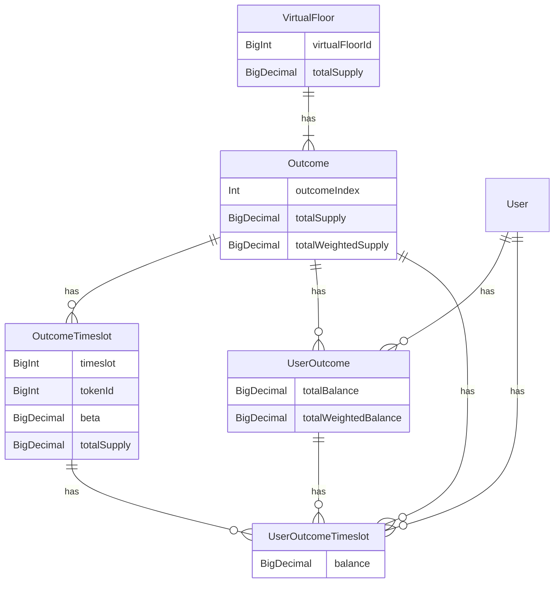

```mermaid
erDiagram
    VirtualFloor ||--|{ Outcome: has

    Outcome ||--o{ OutcomeTimeslot: has

    Outcome ||--o{ UserOutcome: has
    Outcome ||--o{ UserOutcomeTimeslot: has

    User ||--o{ UserOutcome: has
    User ||--o{ UserOutcomeTimeslot: has

    UserOutcome ||--o{ UserOutcomeTimeslot: has
    OutcomeTimeslot ||--o{ UserOutcomeTimeslot: has

    VirtualFloor {
        BigInt virtualFloorId
        BigDecimal totalSupply
    }
    Outcome {
        Int outcomeIndex
        BigDecimal totalSupply
        BigDecimal totalWeightedSupply
    }
    OutcomeTimeslot {
        BigInt timeslot
        BigInt tokenId
        BigDecimal beta
        BigDecimal totalSupply
    }
    UserOutcome {
        BigDecimal totalBalance
        BigDecimal totalWeightedBalance
    }
    UserOutcomeTimeslot {
        BigDecimal balance
    }
```
