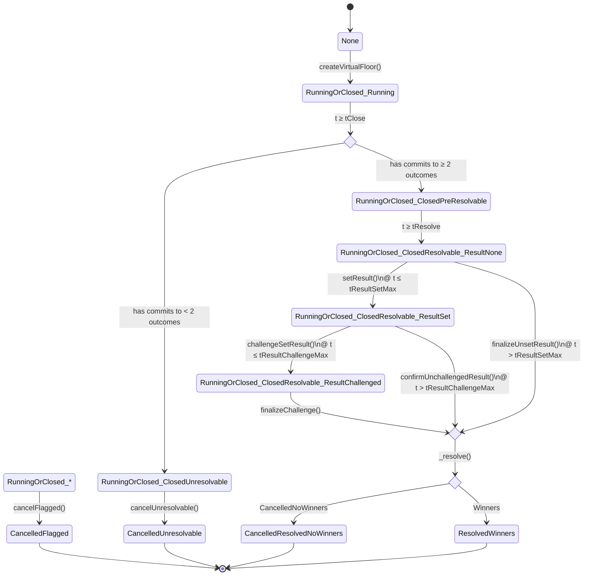

# Virtual-floor state diagrams

## ChallengeableCreatorOracle

We now explode the `RunningOrClosed_ClosedResolvable` state into further sub-states, as stored on the `ChallengeableCreatorOracle` contract:

The only details that are not visible in this diagram are that:
1. When the base contract’s “computed” state (as reported by `getVirtualFloorState()`) goes into `CancelledResolvedNoWinners | ResolvedWinners`, in the extending `ChallengeableCreatorOracle` contract the corresponding `Resolution.state` for that VF will be moved (in parallel) to state `ResolutionState.Complete`.
2. If a VF set-result has been challenged, and therefore its `Resolution.state` in `ChallengeableCreatorOracle` is `ResolutionState.Challenged`, if at that moment the base contract’s state is forced by the platform-admin into `CancelledFlagged`, the `Resolution.state` will be moved (in parallel) into `ResolutionState.ChallengeCancelled`.
